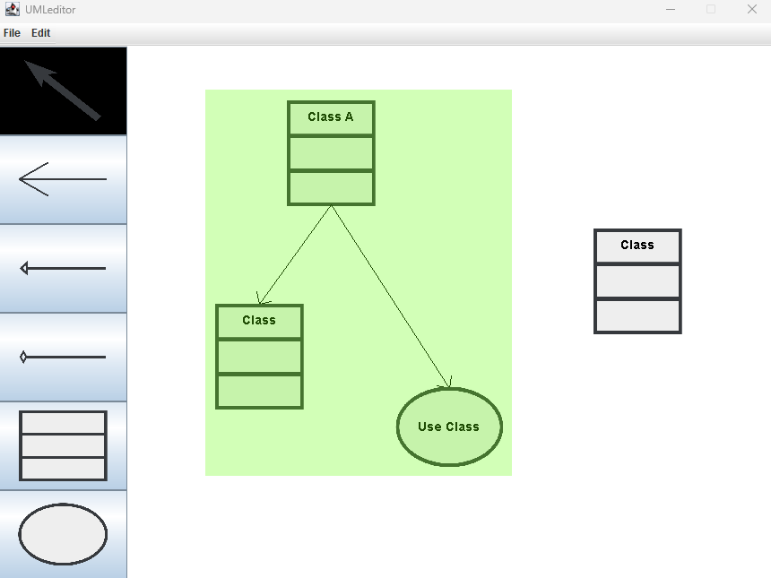

# UMLEditor

## Overview
This project is a UML editor based on Java that provides functionality for creating UML objects. The editor includes canvas, function panel, and a toolbar. The function panel allows users to create UML objects, UML connection lines, and select objects on the canvas. The toolbar provides operations such as renaming objects and grouping/ungrouping objects.

## Environments
- Java 16.0.2
  
## Features

### 1. Buttons

| Button Name   | Description             |
|---------------|--------------------------|
| Select        | Selection mode           |
| Association   | Create an association line   |
| Generalization| Create a generalization line |
| Composition   | Create a composition line    |
| Class         | Create a class object    |
| Use Case      | Create a use case object |

### 2. Functions
#### A. Create Objects
- Allows users to create basic Class and Use Case objects on the canvas

#### B. Move Objects
- Allows users to move objects around on the canvas

#### C. Connect Objects
- Establishes various connection line between objects: Association, Generalization, and Composition

#### D. Group/Ungroup Objects
- Users can select multiple objects by clicking and dragging, then group them using **Edit -> Group** 
- To ungroup, click on a grouped object and use **Edit -> Ungroup** 

#### E. Rename Objects
- When an object is selected, the user can click **Edit -> ChangeName** to rename the object
